<picture>
  <source media="(prefers-color-scheme: dark)" srcset="./dark.svg">
  
</picture>

  <picture>
    <source media="(prefers-color-scheme: dark)" srcset="https://github-stats-extended-backend-sand.vercel.app/api?username=orni-codes&show_icons=true&hide_rank=true&commits_year=2026&hide_border=true&line_height=25&bg_color=0A101F&title_color=22D3EE&icon_color=10B981&text_color=E2E8F0" />
    
  </picture>
  <picture>
    <source media="(prefers-color-scheme: dark)" srcset="https://streak-stats.demolab.com/?user=orni-codes&hide_border=true&card_height=100&background=0A101F&stroke=22D3EE&ring=22D3EE&fire=10B981&currStreakNum=A78BFA&sideNums=E2E8F0&currStreakLabel=64748B&sideLabels=64748B&dates=64748B" />
    
  </picture>

<picture>
  <source media="(prefers-color-scheme: dark)" srcset="https://raw.githubusercontent.com/orni-codes/orni-codes/output/github-contribution-grid-snake-dark.svg" />
  
</picture>
